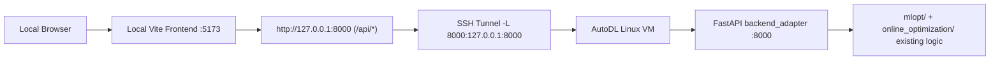

# ML Optimization Workspace

An optimization research workspace that combines the `mlopt` core, scenario pipelines, a thin FastAPI adapter, and a local React workbench for rapid iteration.

This repository is now organized for a practical developer workflow:
- reusable optimization core (`mlopt/`)
- scenario implementations (`online_optimization/`)
- non-invasive API adapter (`backend_adapter/`)
- local frontend (`frontend/`)
- explicit setup docs and helper scripts (`docs/`, `scripts/`)

---

## What This Project Does

This project provides:
1. Core optimization learning capabilities from `mlopt`.
2. Scenario-specific experiment logic from `online_optimization`.
3. A minimal backend adapter exposing stable frontend-facing APIs.
4. A frontend workbench with API-first + fallback behavior for local development.

---

## Current Capabilities

- Run optimization scenarios through a lightweight API layer.
- Use a local frontend against a remote AutoDL backend.
- Connect local frontend to remote backend through SSH local port forwarding.
- Keep core algorithm modules unchanged while improving dev ergonomics.

---

## Repository Structure

```text
.
|- mlopt/                    # Core optimization learning engine (existing core)
|- online_optimization/      # Scenario-specific research and experiment pipelines
|- backend_adapter/          # Thin FastAPI adapter (non-core)
|- frontend/                 # React + Vite frontend workbench
|- docs/
|  |- DEV_SETUP.md           # End-to-end local + remote integration guide
|  `- ENV_VARS.md            # Unified environment variable reference
|- scripts/
|  |- start_backend.sh       # Start FastAPI adapter on Linux/AutoDL
|  |- open_tunnel.sh         # Open SSH tunnel to remote backend
|  |- open_tunnel.ps1        # Open SSH tunnel on Windows PowerShell
|  `- start_frontend.sh      # Start local frontend with API base
`- README.md
```

---

## System Architecture (Local Frontend + SSH Tunnel + AutoDL Backend)



Why this setup:
- frontend remains fast and local
- backend compute and dependencies stay on AutoDL
- no core logic refactor is required

---

## Quick Start (Validated Dev Mode)

Detailed guide:
- [docs/DEV_SETUP.md](docs/DEV_SETUP.md)
- [docs/ENV_VARS.md](docs/ENV_VARS.md)
- [docs/SMOKE_TESTS.md](docs/SMOKE_TESTS.md)

Short version:

1. On AutoDL (Linux), start backend:
```bash
cd /path/to/VibeCoding
./scripts/start_backend.sh
```

2. On local machine, open SSH tunnel (script):
```bash
./scripts/open_tunnel.sh <user@autodl-host>
```

3. On Windows PowerShell, you can use:
```powershell
./scripts/open_tunnel.ps1 -HostName "<autodl-host>" -UserName "<ssh-user>"
```

4. Or use the validated raw SSH command:
```bash
ssh -N -L 8000:127.0.0.1:8000 <user@autodl-host>
```

5. Start frontend locally:
```bash
cd frontend
cp .env.development.example .env.development
npm install
npm run dev
```

6. Open `http://localhost:5173/workbench` and verify `Data source: Backend API`.

---

## API Overview

API contract reference:
- [frontend/API_CONTRACT.md](frontend/API_CONTRACT.md)

Current endpoints:

| Method | Endpoint | Purpose |
|---|---|---|
| GET | `/api/scenarios` | List available scenario definitions |
| POST | `/api/runs` | Execute one scenario run |
| GET | `/api/runs/latest?scenarioId=<id>` | Fetch latest stored run for a scenario |

Error model:
- `400` invalid arguments
- `404` not found
- `500` runtime failure

---

## Troubleshooting

### Frontend still shows mock fallback
- Check `VITE_API_BASE` in `frontend/.env.development`.
- Verify tunnel: `curl http://127.0.0.1:8000/api/scenarios`.
- Verify backend is running on AutoDL and bound to `0.0.0.0:8000`.

### CORS errors in browser
- Set backend env var:
  - `BACKEND_ADAPTER_CORS=http://localhost:5173,http://127.0.0.1:5173`
- Restart backend adapter.

### `/api/runs/latest` returns 404
- Expected before first successful run.
- Trigger a run first with `POST /api/runs` (`{"scenarioId":"portfolio"}`).

### Backend import/solver issues
- Adapter may switch to compatibility mode when runtime deps are unavailable.
- Check `adapterMode` and `adapterNote` in run payload.

---

## Development Notes

- Core boundaries are intentionally preserved:
  - no edits in `mlopt/`
  - no edits in `online_optimization/`
- Adapter + docs/scripts are used to improve integration workflow only.

---

## Roadmap

Short-term:
- queued execution for longer scenario jobs
- richer run history storage (beyond latest)
- API health and diagnostics endpoint

Mid-term:
- authentication and multi-user isolation
- richer chart controls and parameterized scenario runs
- CI checks for docs + API contract compatibility
