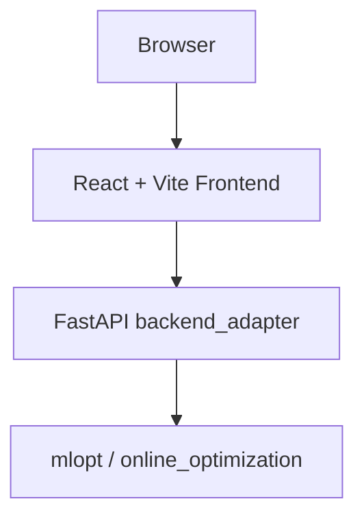

# VibeCoding

[](LICENSE)


[](https://github.com/Linay11/VibeCoding/stargazers)

An optimization experiment workbench that connects a local React UI with remote compute through a thin FastAPI adapter.

## Table of Contents

- [Overview](#overview)
- [Project At A Glance](#project-at-a-glance)
- [Architecture](#architecture)
- [Features](#features)
- [Demo](#demo)
- [Demo Workflow](#demo-workflow)
- [Screenshots](#screenshots)
- [Repository Structure](#repository-structure)
- [Quick Start](#quick-start)
- [Development Workflow](#development-workflow)
- [API Endpoints](#api-endpoints)
- [Tests](#tests)
- [Roadmap](#roadmap)
- [License](#license)

## Overview

VibeCoding is built to make optimization experiments easier to run, inspect, and iterate on from the browser.
It keeps the core logic in `mlopt/` and `online_optimization/`, adds a lightweight `backend_adapter/` for stable APIs, and provides a React + Vite workbench for scenario-driven experiment workflows.

The current development setup is designed for a practical split:
- frontend runs locally for fast iteration
- backend runs on AutoDL for compute-heavy execution
- SSH tunneling connects the local UI to the remote backend

## Project At A Glance

- UI: React + Vite Workbench
- API layer: FastAPI `backend_adapter`
- Optimization core: `mlopt/` and `online_optimization/`
- Recommended dev mode: local frontend + remote AutoDL backend

## Architecture

```text
Browser
  |
  v
React + Vite Frontend
  |
  v
FastAPI backend_adapter
  |
  v
mlopt / online_optimization
```



Supported development mode:
- local frontend + remote AutoDL backend

Typical dev connection:
- local browser opens the Workbench
- frontend sends API requests to `http://127.0.0.1:8000`
- SSH tunnel forwards that local port to the AutoDL backend

## Features

- Experiment Dashboard
- Scenario-based experiment runs
- Result visualization with summary, trend, comparison, and strategy table
- Real / Compat / Fallback execution modes for clear runtime behavior
- AutoDL remote compute integration through a thin FastAPI adapter
- Smoke tests protecting core Workbench interaction flows

## Demo


## Demo Workflow

1. Select a scenario in the Workbench.
2. Run an experiment through the backend adapter.
3. View returned metrics and execution mode.
4. Analyze trends, comparisons, and strategy ranking.

## Screenshots

### Workbench dashboard


### Result summary


### Trend / comparison charts


## Repository Structure

```text
VibeCoding
|- frontend
|- backend_adapter
|- mlopt
|- online_optimization
|- docs
|  |- screenshots
|  `- demo
`- scripts
```

## Quick Start

Backend (AutoDL):

```bash
cd VibeCoding
./scripts/start_backend.sh
```

Open SSH tunnel from local machine:

```bash
ssh -N -L 8000:127.0.0.1:8000 <user@autodl-host>
```

Local frontend:

```bash
cd frontend
npm install
npm run dev
```

Open the app at [http://localhost:5173/workbench](http://localhost:5173/workbench).

If needed, point the frontend to the tunnel endpoint with `VITE_API_BASE=http://127.0.0.1:8000`.

For the full environment and tunnel setup, see [docs/DEV_SETUP.md](docs/DEV_SETUP.md).

## Development Workflow

- frontend runs locally with Vite
- backend runs on AutoDL with `backend_adapter`
- SSH tunnel maps local `127.0.0.1:8000` to the remote backend
- the Workbench uses the backend when available and falls back gracefully when it is not

## API Endpoints

- `GET /api/scenarios`: list available scenarios for the Workbench
- `POST /api/runs`: run an experiment for the selected scenario
- `GET /api/runs/latest`: fetch the latest run result for a scenario

For `power-118`, `POST /api/runs` also accepts:
- `runMode`: `exact`, `hybrid`, or `ml`
- `timeLimitMs`: optional solver time limit for exact or hybrid solves
- `fallbackToExact`: whether ML-related failures may fall back to exact or compat paths

## Power-118 ML Workflow

Build a supervised dataset from perturbed SCUC cases:

```bash
python scripts/build_power118_ml_dataset.py --num-samples 64 --output-dir backend_adapter/data/power118_dataset
```

Train the baseline model and metadata artifacts:

```bash
python scripts/train_power118_model.py --dataset-path backend_adapter/data/power118_dataset/power118_ml_dataset.pkl
```

Default artifacts:
- `backend_adapter/data/power118_ml_model.joblib`
- `backend_adapter/data/power118_ml_metadata.json`
- versioned training artifacts under `backend_adapter/data/power118_model/<timestamp>/`

Run offline evaluation across `exact`, `hybrid`, and `ml`:

```bash
python scripts/eval_power118_modes.py --num-cases 8 --output-dir backend_adapter/data/power118_eval
```

The evaluation script writes:
- JSON records
- CSV records
- JSON summary
- Markdown report

into `backend_adapter/data/power118_eval/` by default.

Key power-118 diagnostic fields returned by the backend:
- `requestedRunMode`
- `solverModeUsed`
- `mlConfidence`
- `repairApplied`
- `fallbackReason`
- `modelVersion`
- `featureSchemaVersion`
- `runtimeMs`
- `objectiveValue`
- `feasible`

For Linux or AutoDL execution, see [docs/POWER118_REMOTE_RUNBOOK.md](docs/POWER118_REMOTE_RUNBOOK.md) or use:

```bash
./scripts/run_power118_remote_pipeline.sh
```

## Tests

Frontend checks:

```bash
cd frontend
npm run test:smoke
npm run lint
```

Backend smoke check:

```bash
python -m pytest backend_adapter/tests/test_run_endpoints.py -q
```

Power-118 backend regression:

```bash
python -m pytest backend_adapter/tests/test_power118_ml_pipeline.py backend_adapter/tests/test_power118_service.py backend_adapter/tests/test_run_endpoints.py -q
```

Smoke tests currently cover the main Workbench interaction path, including:
- scenario loading
- run / refresh flows
- result summary updates
- fallback and compat rendering
- trend, comparison, and state consistency

Backend smoke details are documented in [docs/SMOKE_TESTS.md](docs/SMOKE_TESTS.md).

## Roadmap

- richer visualization and analysis views
- experiment history beyond the latest run
- better real backend execution coverage
- more complete deployment setup

## Current Limits

- `Exact` and `Hybrid` real solves still depend on a valid Gurobi runtime and license, typically on AutoDL.
- If Gurobi, model artifacts, or feature schema checks fail, the backend will fall back honestly to `exact` or `compat` rather than claiming a real SCUC solve succeeded.
- Local evaluation can validate payload structure and fallback behavior even when real exact solves are unavailable, but objective-gap conclusions require a real exact baseline.

## License

[MIT](LICENSE)
